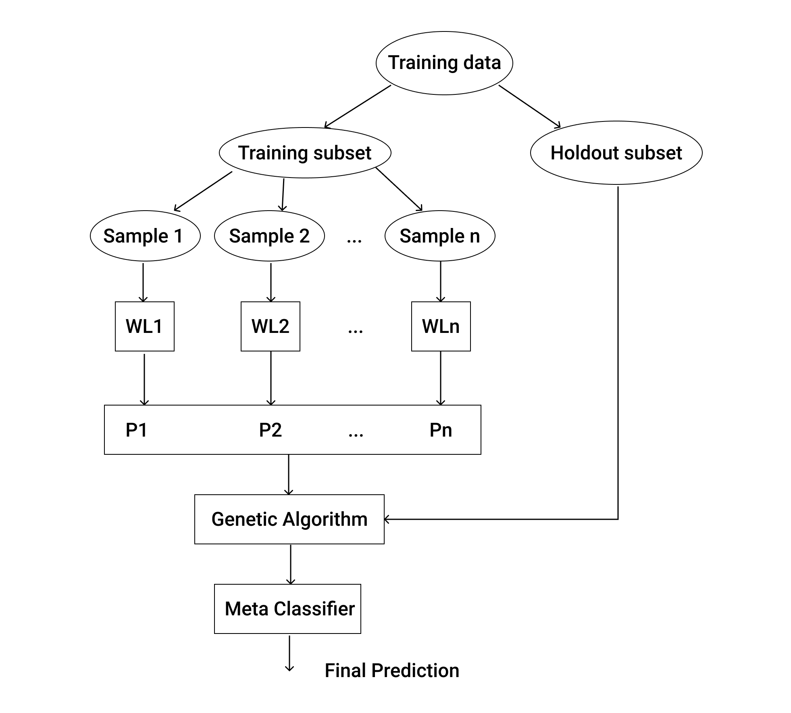
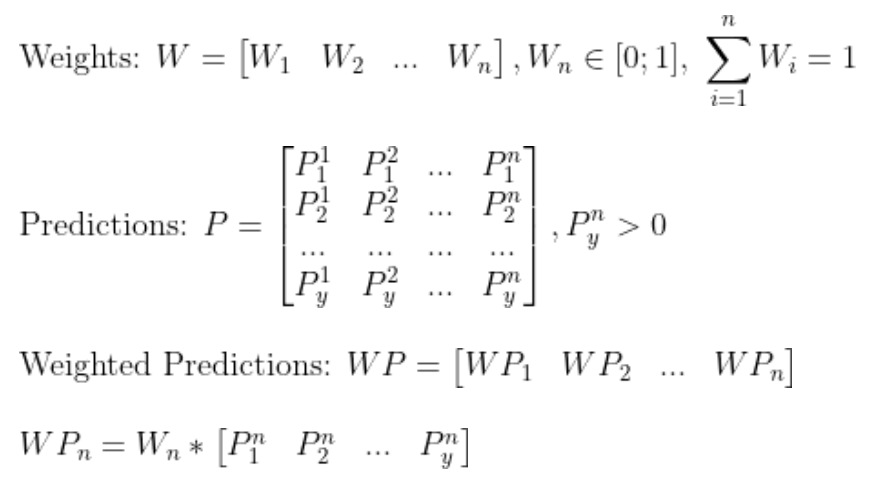
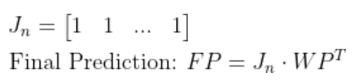

# Genetic Algorithm Optimized Stacking Ensemble (GAOSE)

## Introduction
This project implements a Stacking Ensemble that stacks different Machine Learning (ML) models in order to make better predictions. For each weak learner model there is a weight attributed, which will affect the importance of that model's predictions on the final one. It is used a Genetic Algorithm (GA) to find the optimal weights that gives the best predictions. The final predictions are then given by a Meta Classifier (MC).

## 1 - Ensemble's training flow
When training the ensemble, the data it receives is splitted in two subsets: the training subset and holdout subset. The training subset is then sampled and used to train the weak learner models. The holdout subset is used to find the optimal weights's distribution using the GA.

## 2 - Calculate the Weighted Predictions (WP)
The weights are a distribution of _n_ numbers between 0 and 1, and a total sum of 1 
The predictions matrix (_P_) contains every the predictions made by each model and need to be bigger than 0, else when multiplied by a weight the result would always be 0 and the prediction wouldn't be weighted. 
The weighted predictions are calculated by multiplying each weight by the prediction made by its corresponding model.
 

## 3 - Calculate the Final Predictions (FP)
This final prediction is the result that is returned by the ensemble. Ensentially, the weighted predictions of each model are summed which will return _1xy_ matrix with the final predictions. Since the total sum of the weights is always 1, it isn't necessary to calculate a weighted average. Finally, since a prediction is a natural number, the final results should be rounded.

## 4 - Weights optimization
The mathematical formulas of how each prediction is calculated are covered, but how does the ensemble find the optimal weights' distribution? The answer is using a Genetic Algorithm (GA). 
There were implemented various operators and all of them can be controlled by adjusting the correct paramenters. 

### 4.1 - Mutation
The mutation operator is pretty simple and straightforward. It essentially generates a random number between -2 and 2, selects a random weight and then sums them.

### 4.2 - Crossover
The crossover operator combines two weights' distributions creating two new ones. In this implementation were used the one point crossover and the uniform crossover.

### 4.3 - Handling invalid weights
As it is obvious, by applying these genetic operators the generated weights will probably be different than 1, which means they are invalid. To solve this problem they need to be normalized by dividing each weight by the total sum of the invalid distribution.

### 4.4 - Best fit
To prevent that the best weights are lost in the process of mutations and crossovers, in the begining of each generation it is saved a small fraction of the best weights, so they can be restored before the next generation.

### 4.5 - Population injection
Sometimes a genetic algorithm can be stuck in a local maxima. To try to avoid this, every 150 generations it is generated a batch of new population and added to the mating pool. This might eventually introduce new "breeds" into the population and create more genetic diversity.

### 4.6 - Selection
The selection method used is the tournment selection with the size of 2. In the tournment, there was introduced a small probability that the weaker "fighter" could be "poisonous" and win the tournment, just like some smaller animals can kill bigger opponents with their poison. This can also help prevent a local maxima and increase genetic diversity.

## 5 - Data sampling and decomposition
When training the ensemble, the data is sampled and decomposed before feeding them to weak learners for their training. Each of these weak learners will be getting a sample with replacement of the training data given to the ensemble. The decomposition can be done in two ways: instance-based decomposition and feature-based decomposition. The instance-based decomposition essentially select a fraction of the total instances in the training set and can be controller by the parameter _pInstances_. The feature-based decomposition select a random fraction of the features in that dataset and can be controller by the parameter _pFeatures_. Putting all this together each of the weak learners will get a different sample with different selected features.

## References
This ensemble implementation was based on the [this paper](https://scholarworks.lib.csusb.edu/cgi/viewcontent.cgi?article=1061&context=jitim).
